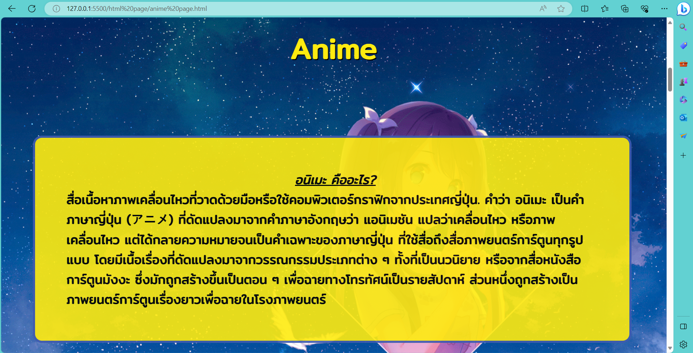

# Web Page Design - My Hobbies

A website that provides information about games and anime that I find interesting.

## Software development environment

> Web Page Design
- Structure the documents and information that will be shown to users as web pages on their browsers by using the `HTML` language.
- `CSS` language is used to style web pages and organize display layouts.
  
 

## User Interface & Features

* ในการออกแบบ จะแบ่งการแสดงผลออกเป็น 3 ส่วนหลักๆ ได้แก่ `Home Page` , `Anime Page` และ `Game Page` เพื่อแบ่งหมวดหมู่และจัดการกับ Content ที่จะแสดง

**1. `[ Home Page ] - หน้าหลัก`** : เป็นหน้าเริ่มต้นของตัวเว็บ ที่จะเป็นการให้ข้อมูลภาพรวมการใช้งานของตัว Project ประกอบไปด้วย
  * **[ Header ]** - `Banner` ของตัวเว็บไซต์ และ `Navigation Bar` โดย default จะกำหนดไว้ที่หน้า Home สามารถใช้เปลี่ยนไปยังหน้าอื่นๆ และกลับมายังหน้า Home ได้
  * `Banner` ของหน้า Home ใช้เพื่อการตกแต่ง
    
    
    
  * **`About Us`** : ให้ข้อมูลเกี่ยวกับวัตถุประสงค์ในการพัฒนาเว็บไซต์นี้ขึ้น

    
    
  * **`Content Categories`** : สามารถเลือกประเภทของเนื้อหาที่สนใจได้ โดยการคลิกที่ตัว Card เพื่อพาไปยังหน้าต่างของ Categories นั้นๆ

    

    
    
    
    
  * **`All Content`** : แสดงรายการเนื้อหาทั้งหมดที่มี โดยไม่ได้มีการแยกตามประเภทของเนื้อหา , สามารถเลือกเนื้อหาที่สนใจได้โดยการคลิกที่ตัว Card เพื่อไปยังหน้าต่างของ Content นั้นๆ

      

    
    
    
  * **[ Footer ]** - `Banner` ของตัวเว็บไซต์ และ `Navigation Bar` ลักษณะเดียวกับด้านบน เพื่อเพิ่มความสะดวกให้กับผู้ใช้ คล้ายกับการ lock ตำแหน่ง navigation bar ไม่ให้เลื่อนตาม cursor  หรือ การใช้ปุ่มเพื่อพากลับไปยัง Header ของ Page พร้อมกับให้ช่องทางการติดต่อในรูปแบบที่เป็นลิงก์ทั้ง `Facebook` , `Twitter` และ `Instagram`

    

**2. `[ Anime Main Page ] - หน้าหลักของเนื้อหาประเภทอนิเมะ`** : สามารถคลิกผ่านเมนู อนิเมะ บน Navigation Bar เพื่อมายังหน้านี้ ซึ่งเป็นหน้าเริ่มต้นของเนื้อหาที่เป็นประเภทอนิเมะ ที่จะเป็นการให้ข้อมูลเกี่ยวกับอนิเมะที่น่าสนใจ ณ เวลาที่จัดทำ (Oct 2021) พร้อมทั้งรีวิว อนิเมะต่างๆโดยผู้จัดทำ ในหน้าต่างนี้ จะประกอบไปด้วย

* **[ Header ]** - `Banner` ของตัวเว็บไซต์ และ `Navigation Bar` โดยจะกำหนดไว้ที่หน้า อนิเมะ ซึ่งเป็นหน้าต่างปัจจุบัน , สามารถใช้เปลี่ยนไปยังหน้าอื่นๆ และกลับมายังหน้า อนิเมะ ได้
* `Banner` ของหน้า อนิเมะ ใช้เพื่อการตกแต่ง

 * **`Anime Definition`** : ให้ข้อมูลความหมายของ keyword คำว่า "Anime" เพื่อสร้างความเข้าใจที่ตรงกันกับผู้ที่สนใจ

 * **`Table of Content - Anime Info`** : ให้ข้อมูลเกี่ยวกับอนิเมะที่น่าสนใจ ซึ่งกำลังฉายอยู่ ณ เวลานั้น (Oct 2021) โดยแบ่ง row ตามวันที่ฉายในสัปดาห์ และตัวข้อมูลจะประกอบไปด้วย รูปหน้าปกของตัวอนิเมะ (Key Visual) , ชื่อเรื่อง , เนื้อหาย่อๆ , จำนวนตอน , ช่องทางการรับชมแบบถูกลิขสิทธิ์ พร้อมลิงค์ไปยังช่องทางดังกล่าว และ วัน-เวลาที่ฉายในทุกๆสัปดาห์ , ลิงค์ไปยัง MAL เป็น reference สำหรับหาข้อมูลเพิ่มเติม

 * **`Table of Content - Viewing Path`** : แสดงช่องทางการชมอนิเมะแบบถูกลิขสิทธิ์หลักๆที่มีในประเทศไทย เพื่อแสดงให้เห็นว่า อนิเมะ แต่ละเรื่องที่กล่าวมา มีให้รับชมในช่องทางไหน - ช่องทางไหนไม่มีให้รับชม

 * **`Content - Anime Review`** : แสดงข้อมูลรีวิวทั้งหมดในหวมหมู่ที่เป็นอนิเมะ สามารถคลิกเพื่อไปยังหน้าต่างๆรีวิวอนิเมะเรื่องนั้นๆได้

  * **[ Footer ]** - `Previous Page Button` คลิกเพื่อกลับไปยังหน้าก่อนหน้าคือ หน้า Home และ `Next Page Button` คลิกเพื่อไปยังหน้าถัดไปคือ หน้า Game , `Navigation Bar` ลักษณะเดียวกับด้านบน เพื่อเพิ่มความสะดวกให้กับผู้ใช้ คล้ายกับการ lock ตำแหน่ง navigation bar ไม่ให้เลื่อนตาม cursor หรือ การใช้ปุ่มเพื่อพากลับไปยัง Header ของ Page

**2.1 `[ Anime Content Page ] - หน้าแสดงรายละเอียดของเนื้อหาประเภทอนิเมะ`** : สามารถคลิกผ่านหน้าหลักของเนื้อหาประเภท อนิเมะ หรือ ในส่วน All Content ที่หน้า Home ได้เพื่อมายังหน้านี้ ซึ่งเป็นหน้าที่เกี่ยวกับรายละเอียดการ รีวิวเนื้อหาที่เป็นประเภทอนิเมะ ประกอบไปด้วย

* **[ Header ]** - `Banner` ของตัวเว็บไซต์ และ `Navigation Bar` โดยจะกำหนดไว้ที่หน้า อนิเมะ ซึ่งเป็นหน้าหลักต่างหลักของเนื้อหาในปัจจุบัน , สามารถใช้เปลี่ยนไปยังหน้าอื่นๆ และกลับมายังหน้า อนิเมะ ได้

* **Anime Review** : เป็นส่วนที่เรียกว่าเป็น `Content Body` หรือ ส่วนของเนื้อหาที่ต้องการนำเสนอในหน้านี้ ประกอบไปด้วย หัวข้อที่นำเสนอ , วันที่เขียนรีวิวนี้ขึ้น , รูปภาพประกอบ , ข้อมูลพื้นฐานเกี่ยวกับตัวอนิเมะที่นำมารีวิว , โลโก้ของสตูดิโอที่ผลิต , ตารางนำเสนอช่องทางการรับชมแบบถูกลิขสิทธิ์ และ เข้าสู่เนื้อหาการรีวิว พร้อมรูปภาพประกอบคำอธิบาย

* **[ Footer ]** - `Previous Page Button` คลิกเพื่อกลับไปยังหน้าก่อนหน้าคือ หน้าหลักของเนื้อหาประเภท อนิเมะ และ `Next Page Button` คลิกเพื่อไปยังหน้าถัดไปคือ เนื้อหารีวิวในหมวดหม฿่เดียวกัน , `Navigation Bar` ลักษณะเดียวกับด้านบน เพื่อเพิ่มความสะดวกให้กับผู้ใช้ คล้ายกับการ lock ตำแหน่ง navigation bar ไม่ให้เลื่อนตาม cursor หรือ การใช้ปุ่มเพื่อพากลับไปยัง Header ของ Page

* **[ Footer ]** - `Related Post` เป็นการเพิ่มความสะดวกให้แก่ผู้ใช้งาน เพิ่มทางเลือกในการเข้าถึงโดยนำลิงก์ที่ใช้ในการเข้าถึงรีวิวอื่นๆมาแปะไว้ด้านล่างของ `Navigation Bar`

> [!NOTE]
> Testing the software via Live Server, not deploying the project for public access.
